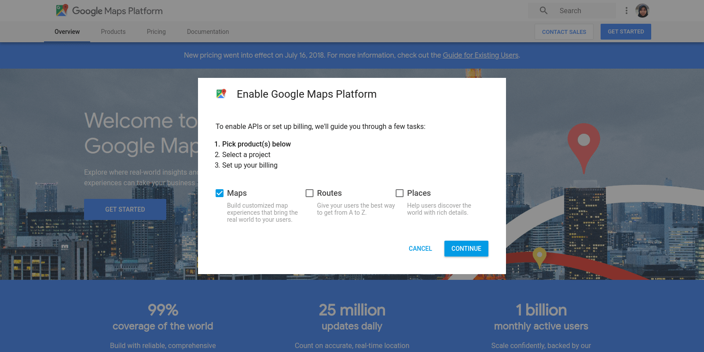
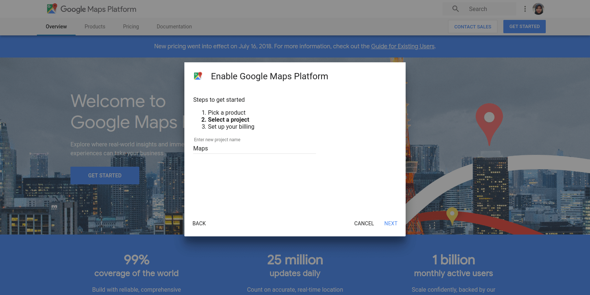
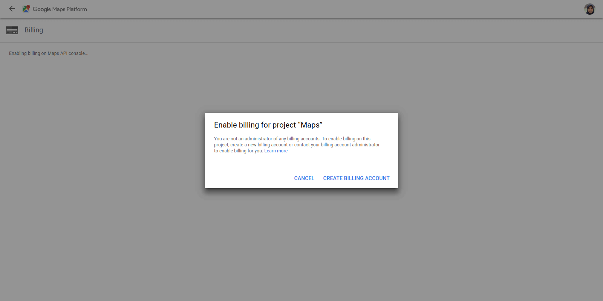
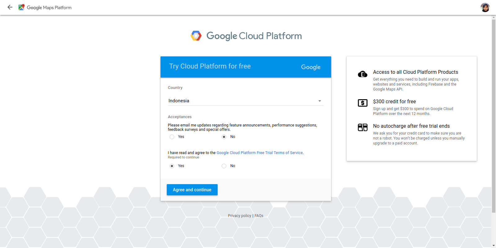
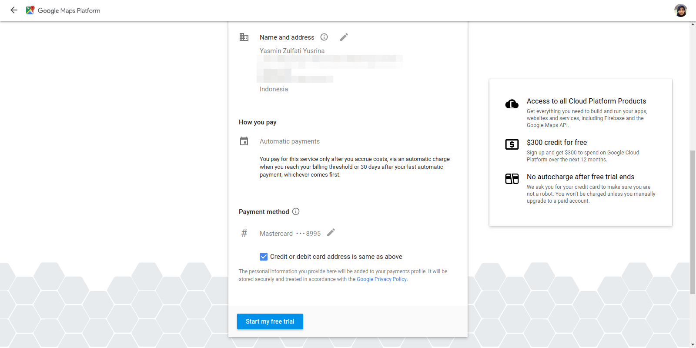
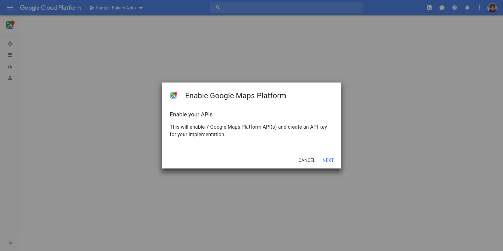
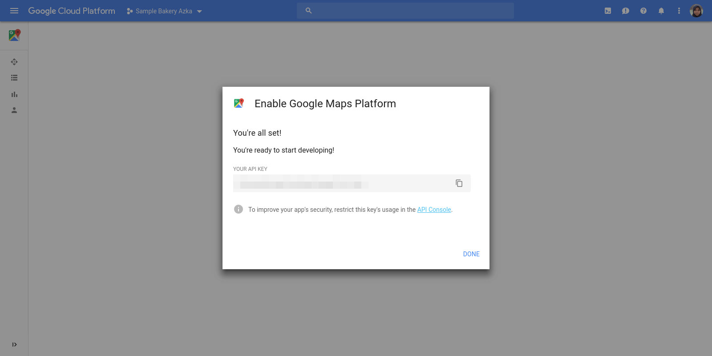

[Vue Google Maps](https://github.com/xkjyeah/vue-google-maps) is a Google maps component for vue with 2-way data binding.

## :key: Get API Key

1. Get an API key from the [Google Maps Platform](https://cloud.google.com/maps-platform/). Click **Get Started**.

2. Pick a product 

3. Select a project 

4. Create a billing account 

5. Accept the terms of service 

6. Create a payment profile 

7. Enable the API 

8. Get the API key 

## :footprints: Steps

1. Create a Vue project and install dotenv and Vue Google Maps.

```bash
npm i -g @vue/cli
vue create vue-demo
cd vue-demo
npm i -D dotenv
npm i vue2-google-maps
```

2. Create a file named `.env` in the project root and paste your API key, e.g.:

```env
VUE_APP_GOOGLE_MAPS_API_KEY=ABcdEfGhIjklmNOpqrsTUvWXyzAbcD1EfGhiJKl
```

3. Register Vue Charts in `src/main.js`.

```js
require("dotenv").config();

import * as VueGoogleMaps from "vue2-google-maps";
Vue.use(VueGoogleMaps, {
  load: { key: process.env.VUE_APP_GOOGLE_MAPS_API_KEY }
});
```

4. Use Vue Google Maps, e.g. in `src/views/google-maps.vue`.

<<< @/vue-demo/src/views/google-maps.vue

## :book: Explanation

- Specify the map center with `center`.
- To make the map zoomed in, increase the `zoom` value.
- Available map types for `map-type-id`:
  - roadmap
  - hybrid
  - satellite
  - terrain
- Put markers in many locations with `gmap-marker`.
